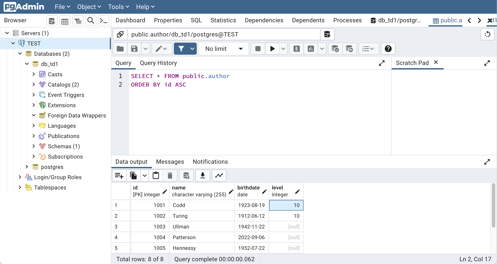

# Playing SQL from Notebook

## Setup


## Start the DBMS

```bash
mkdir -p data/postgres
docker-compose up -d
```

```bash
docker-compose ps
docker-compose logs -f
```

Interact with the DBMS using the [`psql` command](https://docs.postgresql.fr/10/app-psql.html).
The password is still `changeme`.
```bash
docker exec -it postgres_container psql -U postgres -W
```

## Execute the PSQL statements

```sql
\l

-- Drop the existing database if exists
DROP DATABASE IF EXISTS db_td1;

-- Create a new database
CREATE DATABASE db_td1;

-- Connect to the database
\connect db_td1

SET statement_timeout = 0;
SET lock_timeout = 0;
SET idle_in_transaction_session_timeout = 0;
SET client_encoding = 'UTF8';
SET standard_conforming_strings = on;
SET check_function_bodies = false;
SET client_min_messages = warning;
SET row_security = off;

DROP TABLE IF EXISTS AUTHOR CASCADE;
DROP TABLE IF EXISTS TURING_AWARD;

-- Create the table AUTHOR
CREATE TABLE AUTHOR (
   ID           SERIAL PRIMARY KEY  NOT NULL,
   NAME         VARCHAR (255) NOT NULL,
   BIRTHDATE    DATE NOT NULL DEFAULT CURRENT_DATE,
   LEVEL        INT
);

-- Show tables
\d
-- Show schema of table AUTHOR
\d AUTHOR

-- Insert four new rows into table AUTHOR
INSERT INTO AUTHOR (ID, NAME, BIRTHDATE, LEVEL) VALUES
    (1001, 'Codd', '1923-08-19', 10),
    (1002, 'Turing', '1912-06-12', 10),
    (1003, 'Ullman', '1942-11-22', NULL),
    (1004, 'Patterson', DEFAULT, NULL),
    (1005, 'Hennessy', '1952-07-22', NULL),
    (1006, 'Stonebraker', '1943-10-11', NULL);
    (1009, 'Petri', '1926-07-12', NULL);

-- Show authors
SELECT * FROM AUTHOR;

-- Show authors without level
SELECT * FROM AUTHOR WHERE LEVEL IS NOT NULL;

-- Insert a new row into table AUTHOR
INSERT INTO AUTHOR (NAME, BIRTHDATE) VALUES
    ('Gray', DEFAULT);

-- Show tables
\d
-- Show schema of table AUTHOR
\d AUTHOR
-- Show schema of AUTHOR_ID_SEQ table used for sequencing the ID column of table AUTHOR
\d AUTHOR_ID_SEQ

-- Show authors
SELECT * FROM AUTHOR;

-- Show the three first authors
SELECT * FROM AUTHOR LIMIT 3;

-- Show authors sorted by birthdate
SELECT * FROM AUTHOR ORDER BY BIRTHDATE ASC;

-- Show authors sorted by age
SELECT NAME, AGE(BIRTHDATE) AS AGE FROM AUTHOR ORDER BY AGE ASC;

-- Show authors sorted by age (descending)
SELECT NAME, AGE(BIRTHDATE) AS AGE FROM AUTHOR ORDER BY AGE DESC;

-- Import a CSV file into a table using COPY statement
COPY AUTHOR(ID, NAME, BIRTHDATE, LEVEL)
FROM '/work/authors.csv'
DELIMITER ','
CSV HEADER;

-- Show authors
SELECT * FROM AUTHOR;

-- Create the table TURING_AWARD
CREATE TABLE TURING_AWARD (
   YEAR         INT NOT NULL,
   ID           INT,
   CONSTRAINT FK_AUTHOR
      FOREIGN KEY(ID) 
	  REFERENCES AUTHOR(ID)
);

-- Insert new rows into table TURING_AWARD (See https://en.wikipedia.org/wiki/Turing_Award)
INSERT INTO TURING_AWARD (ID, YEAR) VALUES
    (1001, 1981),
    (1003, 2020),
    (1004, 2017),
    (1005, 2017),
    (1006, 2014),
    (1007, 2013),
    (1008, 1974);

-- Show turing awards ordered by year
SELECT * FROM TURING_AWARD ORDER BY YEAR ASC;

-- Show name of authors with turing award
SELECT * FROM AUTHOR A, TURING_AWARD T WHERE A.ID=T.ID;
SELECT * FROM AUTHOR A NATURAL JOIN TURING_AWARD T;
SELECT * FROM AUTHOR A INNER JOIN TURING_AWARD T ON A.ID=T.ID;
SELECT * FROM AUTHOR A LEFT JOIN TURING_AWARD T ON A.ID=T.ID;
SELECT * FROM AUTHOR A RIGHT JOIN TURING_AWARD T ON A.ID=T.ID;
SELECT * FROM AUTHOR A FULL JOIN TURING_AWARD T ON A.ID=T.ID;

-- Show name of authors with turing award ordered by year
SELECT A.NAME, T.YEAR FROM AUTHOR A, TURING_AWARD T WHERE A.ID=T.ID ORDER BY YEAR ASC;

-- Show name of authors that are not awarded
SELECT NAME FROM AUTHOR WHERE ID NOT IN (SELECT ID FROM TURING_AWARD);
```

## Extra statements

### Date and Time

```sql
-- Show current date
SELECT CURRENT_DATE;

-- Show current time
SELECT CURRENT_TIME;

-- Show current time
SELECT CURRENT_TIME(2);

-- Show current time
SELECT LOCALTIME;

-- Convert date
SELECT TO_TIMESTAMP(
    '2022-09-01 12:00:00',
    'YYYY-MM-DD HH:MI:SS'
);

-- Show current timestamp
SELECT NOW();
```

## PGAdmin

Browse the [PGAdmin console](http://localhost:5050).

Set a new password for PGAdmin.

Add a new server.
* In `General` tab, The `name` is `TEST`.
* In `Connection` tab, the `hostname` is `postgres_container`, the `username` is `postgres` and the  `password` is `changeme`.

Browse the DB tree on the left panel.




## Start Jypiter and open the notebook

```bash
jupyter notebook
```

Open the notebook `postgres-01.ipynb`

## Enjoy


## At the end

Dump the database
```bash
docker exec -it postgres_container pg_dumpall -c -U postgres > dump.sql
```

Stop and remmove the composition
```bash
docker-compose down
```

Remove the DBMS files
```bash
rm -fr data/
```


## Nota Bene
* Postgres files are stored in the host dir ./data/postgres


## References
* https://www.postgresqltutorial.com/postgresql-tutorial
* https://www.compose.com/articles/getting-started-with-compose-postgresql-and-jupyter-notebooks/
* https://medium.com/analytics-vidhya/postgresql-integration-with-jupyter-notebook-deb97579a38d
* https://engineering.fb.com/2022/04/26/developer-tools/sql-notebooks/
